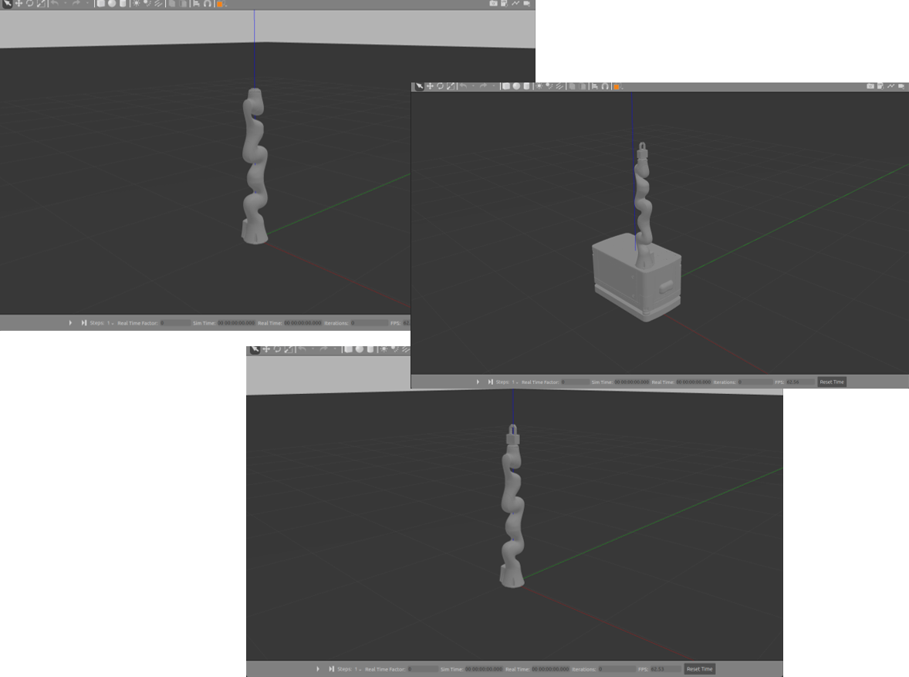

# kmr-iiwa-gripkit-cr-plus-l
URDF and MoveIt configuration (ROS1) files of [Gripkit-CR-Plus-L](https://weiss-robotics.com/gripkit/) and [KRM-iiwa 7](https://www.kuka.com/en-us/products/mobility/mobile-robot-systems/kmr-iiwa). Depending on user's inputs (e.g., end_effector, mobile_base, and controllers), the URDF and MoveIt ***reconfigure*** themselves. The reposity also provides a simple Gazebo environment and Python classes and functions to experiment ***object grasping***.  

## Table of Contents

- [Repository Structure](#repository-structure)
- [Download Process](#download-process)
- [Usages](#usages)
    - [Gazebo](#gazebo)
    - [MoveIt](#moveit)
    - [MoveIt and Gazebo](#moveit-and-gazebo)
    - [Automated Pick](#automated-pick)
- [Potential Extensions](#potential-extensions)
- [ToDo Lists](#todo-lists)

---

## Repository Structure
    ├── auto_pick
    │   └── src                           # Python source codes
    ├── gripkit_cr_plus_l_ad_description
    ├── gripkit_cr_plus_l_ad_description
    │   ├── meshes                        # STL files
    |   └── urdf                          # URDF description
    ├── gripkit_cr_plus_l_bb_description
    ├── gripkit_cr_plus_l_cc_description
    ├── gripkit_cr_plus_l_dd_description
    ├── iiwa7_description
    ├── images              
    ├── kmp200_description
    ├── kmriiwa_description  
    ├── kmriiwa_moveit
    │   ├── config                        # config files
    │   └── launch                        # ROS-launch files
    ├── models
    │   ├── dict                          # grasp dictionaries
    │   └── rotary_arm                    # object folder
    └── worlds

## Download Process

This repository has been tested on [ROS Noetic](http://wiki.ros.org/noetic/Installation/Ubuntu) and [Ubuntu 20.04](https://releases.ubuntu.com/focal/).
It also depends on **numpy** and **scipy**:

    cd ~/catkin_ws/src
    git clone https://github.com/kidpaul94/kmr-iiwa-gripkit-cr-plus-l.git
    cd kmr-iiwa-gripkit-cr-plus-l/
    pip3 install -r requirements.txt
    cd ~/catkin_ws
    catkin_make
    source devel/setup.bash

## Usages
  
### Gazebo:

    roslaunch kmriiwa_description gazebo.launch robot_name:=(choose iiwa or kmriiwa) hardware_interface:=(choose Position, Velocity, or Effort) ee_type:=(choose ad, bb, cc, or dd)
    
### MoveIt:

    roslaunch kmriiwa_moveit demo.launch robot_name:=(choose iiwa or kmriiwa) hardware_interface:=(choose Position, Velocity, or Effort) ee_type:=(choose ad, bb, cc, or dd)

**Note:** You can also checkout more arguments in the launch file.

### MoveIt and Gazebo:

    roslaunch kmriiwa_moveit demo_gazebo.launch robot_name:=(choose iiwa or kmriiwa) hardware_interface:=(choose Position, Velocity, or Effort) ee_type:=(choose ad, bb, cc, or dd)

**Note:** You can also checkout more arguments in the launch file.

### Automated Pick:
simulation.py receives several different arguments. Run the `--help` command to see everything it receives.

    cd auto_pick/src
    python3 simulation.py --help

## Potential Extensions
To run your own world with other objects, simply put them in the **models** and **worlds** folders. You can also swap **iiwa 7** with **iiwa 14**.

## ToDo Lists

| **Model & Controller parameters tuning** |  |
| --- | --- |
| **Automation of picking** |  |
